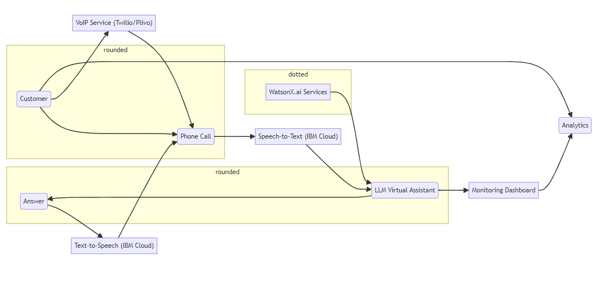

# Live Phone Call Analytics with WatsonX.ai

This project aims to enhance the customer experience in real-time by building a powerful virtual assistant powered by Large Language Models (LLMs) and leveraging human feedback for continuous improvement. We'll achieve this by:

- **Building a Live Phone Call Analytics Dashboard:** This dashboard will monitor and analyze interactions between customers and the AI assistant, providing insights into call quality and areas for improvement.
- **Developing an LLM Virtual Assistant:** The virtual assistant will use WatsonX.ai and reinforcement learning to retrieve and provide accurate answers to customer inquiries.

**Project Structure**

The project is divided into three main components, each with its dedicated README.md file for further details:

1. **LLM Virtual Assistant ([assistant/](./assistant/README.md).)** For more details  
    - This section details the creation of a chatbot powered by WatsonX.ai. 
    - You'll utilize a simple vector database to store question-answer pairs.
    - The standard Retriever-Augmented Generation (RAG) technique retrieves the most relevant answer for a given question.
    - Reinforcement learning is implemented to continuously improve the model's performance through updates (frequency mentioned in the assistant/README.md).

2. **AI Microservices ([microservices/](./microservices/README.md))**
   - This section describes the integration of various IBM Cloud microservices:
      - Speech-to-Text: Converts spoken customer inquiries into text.
      - Text-to-Speech: Converts the assistant's responses into audio for the caller.
      - VoIP services: Enable triggering phone calls to the system for interaction with the assistant.

3. **Monitoring Dashboard ([dashboard/](./dashboard/README.md))**
   - This section explains the creation of a custom server on IBM Cloud Engine to host the real-time call analytics dashboard.
   - The dashboard likely visualizes data collected from call interactions using the AI microservices.

**Building and Running the Project**

Detailed instructions for building and running the project, including setting up WatsonX.ai services, deploying the dashboard, and configuring AI microservices, are not included in this main README.md.  However, you might consider creating a separate document or section within this README.md to link to specific build instructions or refer users to relevant documentation. 

**Continuous Improvement Strategies**

1. **Knowledge Base Expansion:** Regularly update the question-answer vector database with new entries to enhance the assistant's knowledge.
2. **Flagged Conversation Analysis:** Review flagged conversations (conversations identified as needing human intervention) to identify recurring issues and improve the assistant's handling of similar situations. 
3. **Refined Reinforcement Learning:** Explore more advanced reinforcement learning techniques and adjust the model update frequency based on observed performance to optimize the learning process.
## Infrastructure Diagram [diagram/](./assets/diagram.md)

The system utilizes a layered architecture.  WatsonX.ai provides the core AI functionalities. Users initiate phone calls, which are converted to text and sent to the virtual assistant for processing. The assistant retrieves answers, converts them to speech, and relays them back to the user through the phone call. A separate service facilitates these phone calls. Additionally, the assistant sends data for analysis to a monitoring dashboard that provides insights for continuous improvement.

**Contributing**

We welcome contributions to further develop and expand this project. Here's how you can contribute:

1. Fork the repository.
2. Create a new branch with a clear and descriptive name.
3. Implement your changes and commit them to your branch.
4. Submit a pull request to the main repository for review and merging.

**License**

This project is licensed under the MIT License. See the MIT: LICENSE file for details.

**Acknowledgements**

- WatsonX.ai for providing the AI services and infrastructure.
- IBM Cloud for hosting the monitoring dashboard and AI microservices.
- The open-source community for their continuous support and inspiration.

By combining the power of LLMs, real-time call analytics, and human feedback, this project strives to create a superior customer experience through AI-powered virtual assistants.
