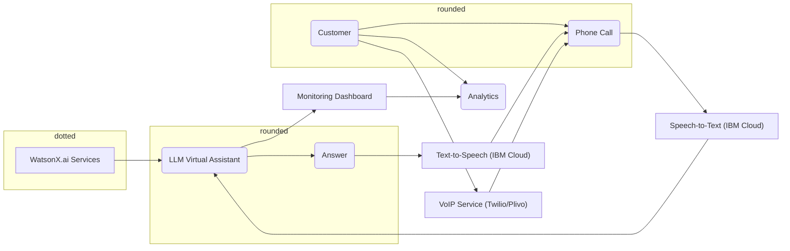

## Infrastructure Diagram

The Live Phone Call Analytics with WatsonX.ai leverages a layered architecture. WatsonX.ai provides the core AI services (A). Users initiate phone calls (B) that are converted to text by Speech-to-Text (F) and routed to the LLM Virtual Assistant (D) for processing. The assistant retrieves answers (E) which are converted to speech by Text-to-Speech (G) and played back to the user. A VoIP service (H) facilitates phone calls. Meanwhile, the assistant sends data for analysis to the Monitoring Dashboard (I) which provides insights used for improvement. 

